# StoreQL: what it does for your business

A walkthrough for a retailer. It shows, in pictures, what happens in StoreQL from the moment goods arrive at your back door to the moment the books are closed, and everything a customer, a cashier and a manager do in between.

We are showing you this to learn from you. Every section ends with a few questions. Where something does not match how your shops really work, that is exactly what we want to hear.

**How to read the pictures**

- A **solid box** is something StoreQL does today and that has been tested.
- A **dashed box** is designed and being built next. It is shown so you can tell us whether it matters to you.
- Under each picture, *Proven by* names the matching part of our test catalogue ("StoreQL Flow Tests"), where every step is written down as a test case. Figures are as of 30 September 2026.

---

## 1. The whole thing on one page

One system for the shop floor, the online shop and the office. They share one record of stock, prices, customers and money, so they never disagree.

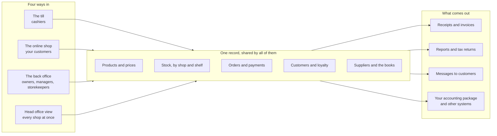

| Area | What you can do | Tested today |
|---|---|---|
| The till | Sell, take any mix of payments, hold sales, work offline, cash up | 121 of 162 steps |
| Returns and refunds | Take goods back, exchange, void, refund to the right place | 121 of 127 |
| The online shop | Browse, order, collect or have delivered, be told what is happening | 92 of 170 |
| Stock control | Receive, put away, move, count, mark down, recall | 135 of 224 |
| Buying and the books | Quotes, orders, deliveries, invoices, payments, ledger, VAT | 199 of 214 |
| Products and prices | Catalogue, price lists, promotions, markdowns, tax | 156 of 162 |
| Setup, people and access | Shops, staff, roles, sign-in, plans, audit | 248 of 290 |
| Customers and reports | Records, loyalty, gift cards, messages, reports | 143 of 183 |

**1,215 of 1,532 written steps are tested automatically today.** The rest are written down and being automated. A further 166 checks are listed as still open; nearly all are designed for the next round of building (section 12).

---

## 2. Your business, your shops, your shelves

StoreQL is laid out the way your business is. Nothing about your country, currency, tax, phone numbers, time zone or language is assumed: it all comes from how you set it up.

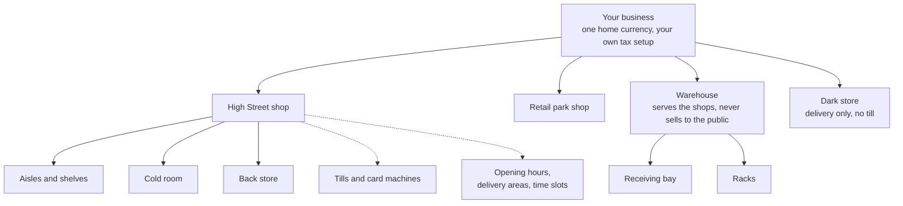

- Each shop has its own address, opening hours, accepted payment methods, delivery areas and collection or delivery time slots.
- Stock is always "at this shop, in this place", not just a number for the whole business.
- A new business is set up in a few minutes: sign up, name the business, create the first shop, and you can receive stock and take a sale.

*Proven by:* Flow Tests → **Business setup, people and access** → "Self sign-up and the setup wizard", "Stores, zones, till-phone choice and store open/close", "Delivery areas and delivery/collection windows".

**Questions for you**
1. How many sites do you have, and are any of them warehouses or delivery-only?
2. Do your shops price, stock or trade differently from each other?
3. Who sets up a new shop today, and how long does it take?

---

## 3. A sale at the till

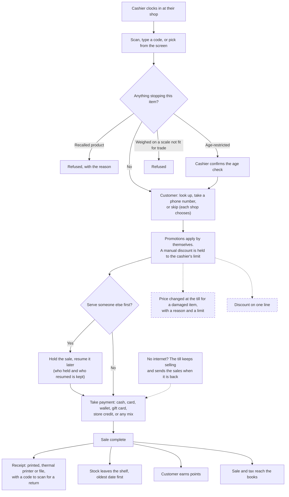

**At the end of the shift**

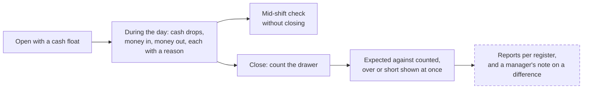

What else the till handles today: held sales, layaway (pay in instalments, collect when paid), special orders, gift cards sold and spent, bottle and container deposits, opening the drawer without a sale (logged), and shops that sell without showing prices until a manager prices the order.

*Proven by:* Flow Tests → **Point of sale and the till** (12 flows) → "Ringing up a sale", "Discounts, role ceilings and automatic promotions", "Hold, resume and discard a sale", "Tender: cash, card, UPI/wallet, gift card, store credit and splits", "Offline selling and replay", "Till session cash control".

**Questions for you**
1. Which payment methods do you take, and how often does a customer split a payment?
2. When a price is wrong at the till, who is allowed to change it, and by how much?
3. How do you cash up today, and what difference do you tolerate before someone has to explain it?
4. How often does the internet fail in your shops, and what do you do when it does?

---

## 4. An online order, from basket to doorstep

The online shop shows the same products, prices and stock your staff see. A shopper can browse without an account and signs in only to place the order.

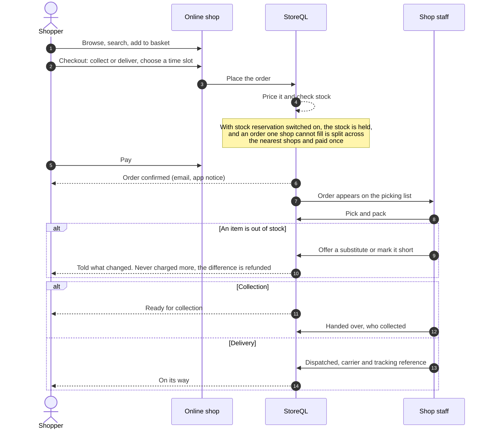

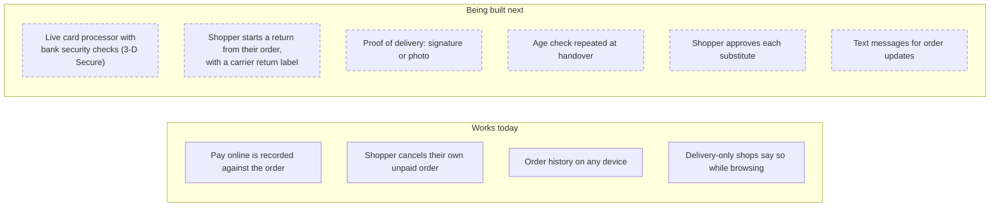

> **Said plainly:** today the online checkout records that a payment was made. Connecting it to a live card processor, so the money is taken and verified by the bank, is designed and is the first thing in the next round of building. In-shop payments are not affected.

*Proven by:* Flow Tests → **The online shop and fulfilment** (11 flows) → "Checkout", "Split fulfilment across shops", "Picking and packing", "Substitutions and short lines", "Handover", "Notifications to the shopper".

**Questions for you**
1. Do you sell online today? Through your own site, a marketplace, or both?
2. Collection, delivery, or both? Who delivers: your own drivers or a carrier?
3. When an item is out of stock, do you substitute, and does the customer get a say?
4. Which card processor do you use, and would you change it?

---

## 5. When goods come back

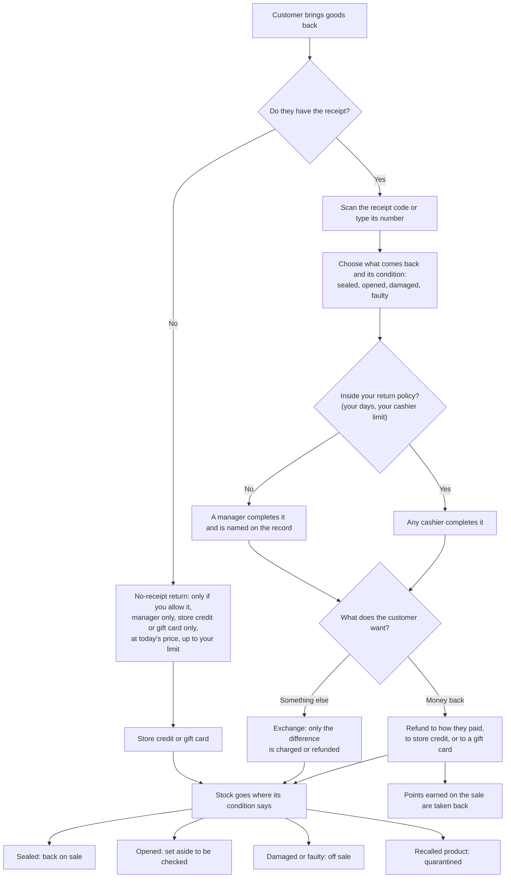

Also covered today: voiding a sale rung up by mistake, cancelling an order before it is handed over, refunds made from the office, chargebacks from the card network, and a full trail of who returned, voided or refunded what.

- A refund gives back what the customer actually paid, tax included, and their share of any discount on the sale.
- Pressing the button twice, or a retry after a lost connection, never refunds twice.

*Proven by:* Flow Tests → **Returns, refunds and voids** (12 flows, 121 of 127 steps tested) → "Return at the till against the original sale", "Return with no receipt", "Exchanges", "Disposition of returned stock", "Chargebacks".

**Questions for you**
1. What is your return policy: how many days, and who can approve an exception?
2. Do you take goods back without a receipt? On what terms?
3. What happens to returned goods in your shops today: back on the shelf, checked first, sent back to the supplier?

---

## 6. The back office: products and prices

```mermaid
flowchart LR
    subgraph CAT["Catalogue"]
        P1["Products and their sizes or packs,<br/>each with its own code and barcode"]
        P2["Categories and brands"]
        P3["Safety information, allergens,<br/>age restriction, deposit"]
        P4["Pictures"]
        P5["Life of a line: new, active,<br/>discontinued, delisted"]
    end
    subgraph PRICE["Prices"]
        Q1["Price lists by channel and date,<br/>with full history"]
        Q2["Price zones: shops that price alike"]
        Q3["Tax rates and categories"]
        Q4["Price per kilo or litre"]
        Q5["Prices shown in another currency,<br/>never charged in it"]
    end
    subgraph DEALS["Offers"]
        D1["Promotions: percentage, amount,<br/>buy one get one, spend thresholds"]
        D2["Coupons with limits per customer"]
        D3["Markdown stickers for short-dated stock"]
        D4["Competitor prices: the system proposes,<br/>a person decides"]
    end
    CAT --> PRICE --> DEALS
    DEALS --> TILL["The till"]
    DEALS --> WEB["The online shop"]

    N1["Tax rate changes dated in advance"]:::next
    N2["Small price changes applied automatically<br/>within a limit you set"]:::next
    N3["A second approval for a very deep discount"]:::next
    PRICE -.-> N1
    DEALS -.-> N2
    DEALS -.-> N3
    classDef next stroke-dasharray: 6 4;
```

Checks that already protect you: the same code or barcode cannot be used twice, a barcode's check digit is verified, a category cannot be placed inside itself, and a promotion cannot be spent against another business.

*Proven by:* Flow Tests → **Catalogue, pricing and promotions** (13 flows, 156 of 162 steps tested).

**Questions for you**
1. How many product lines do you carry, and how do you load them today (by hand, a spreadsheet, your supplier's file)?
2. Do prices differ by shop or region?
3. Which kinds of offers do you run most?
4. Who may change a price, and does anyone check it?

---

## 7. The back office: stock, from the back door to the shelf

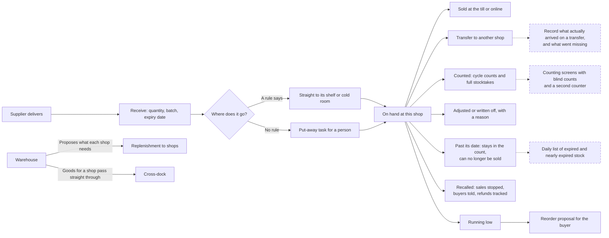

Specialist stock StoreQL already understands:

| If you... | StoreQL... |
|---|---|
| hold a supplier's goods until they sell | keeps it apart as **consignment**, and works out what you owe when it sells |
| have suppliers ship direct to the customer | treats it as **dropship**: sold without ever being in your stockroom |
| hold goods with duty unpaid | keeps **bonded** stock out of sale until duty is released |
| cut meat or portion fresh food | records a **yield run**: one primal in, several cuts out, the loss measured |
| run a warehouse for your shops | proposes **replenishment** per shop and shares a short delivery fairly |
| pick many online orders at once | builds **picking waves** in shelf order |
| plan shelf space | keeps **planograms** and shows shelf gaps |

*Proven by:* Flow Tests → **Inventory and stock control** (16 flows) → "Receiving stock", "Transfers between stores", "Cycle counts and stocktakes", "Product recalls and withdrawals", "Expiry and markdown of short-dated stock", "Depot/DC replenishment proposals", "Stock valuation".

**Questions for you**
1. Do you track batches and expiry dates? For which products?
2. How do you count stock today, how often, and who signs off a difference?
3. How do goods get from your warehouse (or supplier) to each shop?
4. Have you had a product recall? What was hardest about it?

---

## 8. The back office: buying, suppliers and the books

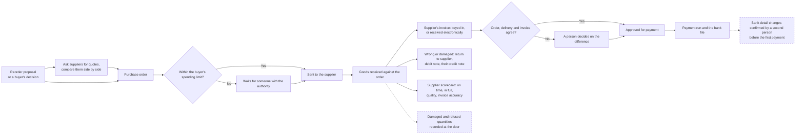

**Where the money goes.** Every sale, refund, delivery and payment writes itself into the ledger. Nobody re-keys anything.

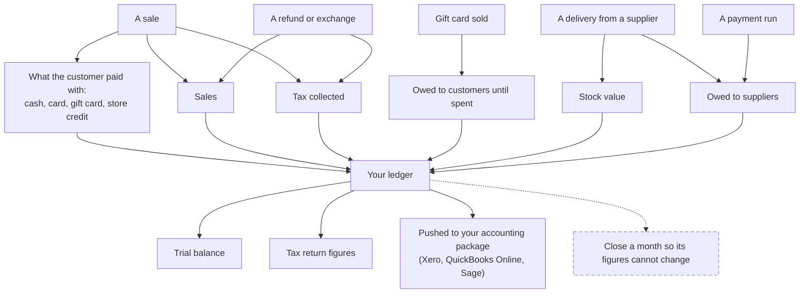

Tax rules that apply only in one country (for example the UK's online VAT filing) are used only by a business in that country.

*Proven by:* Flow Tests → **Procurement, suppliers and finance** (15 flows, 199 of 214 steps tested) → "Request for quotation, comparison and award", "Purchase order approval by spend authority", "Supplier invoice capture, three-way match and variance decision", "Supplier payment runs, bank files and duplicate/payee protection", "Nominal ledger, manual journals, period close and trial balance", "Accounting package connection and journal sync".

**Questions for you**
1. Who places orders with suppliers, and is there a spending limit?
2. How do supplier invoices reach you, and who checks them against what arrived?
3. Which accounting package do you use? What do you key into it by hand today?
4. How do you pay suppliers: one by one, or in a run?

---

## 9. The back office: people, access and keeping watch

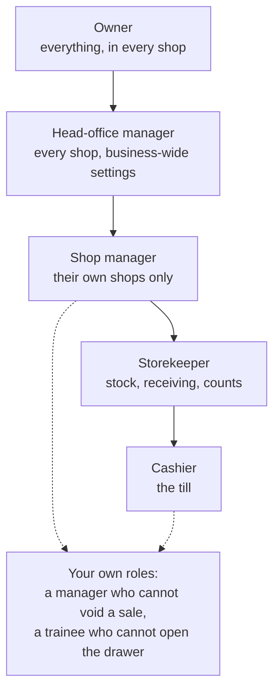

| What | How StoreQL handles it today |
|---|---|
| Signing in | Password rules you can read before typing, a second step (authenticator code) where you require it, sign-in through your own company login, sign out of every device |
| Staff | Add by email, assign to a shop with a role, a shift roster and a time clock |
| Daily running | Task checklists per shop, announcements staff must acknowledge |
| Who did what | A trail of discounts, voids, returns, drawer openings and cancellations by person. A separate trail of changes to shops, staff and roles. Security events such as failed sign-ins |
| Refused by design | A shop manager cannot change another shop, only an owner can make another owner, and nobody can hand out more access than they hold |

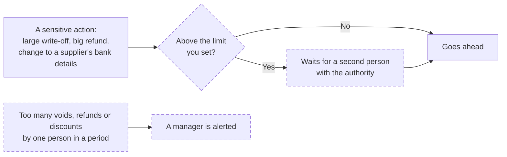

The approval limits and the alerts in the second picture are designed and being built next. Limits are yours to set: nothing is switched on, and no figure is chosen, until you choose it.

*Proven by:* Flow Tests → **Business setup, people and access** (19 flows, 248 of 290 steps tested) → "Staff: assign by email, roles, custom roles, store-held managers", "Second factor", "Passwords", "Business audit trail and platform security incidents".

**Questions for you**
1. What roles do you really have in a shop, and what is each one not allowed to do?
2. Which actions need a second person today, on paper or in practice?
3. What would you want to be alerted about the same day?

---

## 10. The back office: customers, loyalty and messages

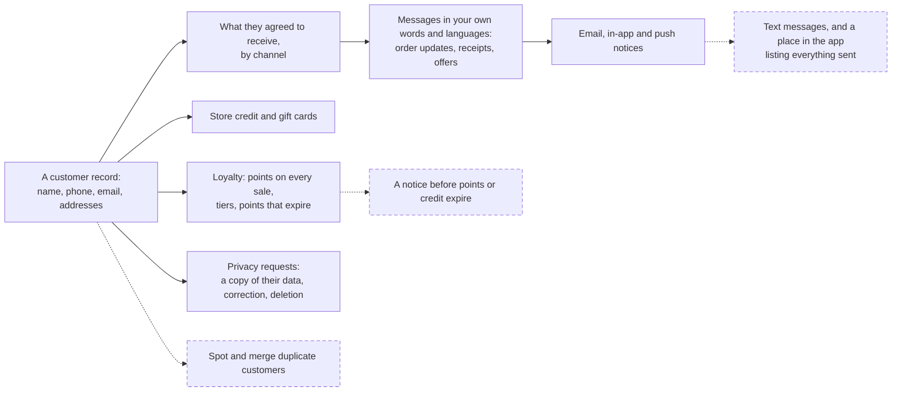

- Points and store credit given by hand are for managers only, always with a reason.
- Marketing goes only where consent is recorded, and withdrawing consent switches it off at once.
- Your other systems can be told about events as they happen (orders, payments, price changes).

*Proven by:* Flow Tests → **Customers, loyalty, messages and reports** (15 flows) → "Loyalty: earning and redeeming points", "Store credit and gift cards", "Marketing consent, channels, and the send-time allowance check", "Privacy rights".

**Questions for you**
1. Do you run a loyalty scheme? What does a customer get, and what does it cost you?
2. How do you contact customers today, and how do you record that they agreed?
3. Do you sell gift cards? Do they expire?

---

## 11. The back office: reports

| Report | What it answers |
|---|---|
| Sales by day, hour, staff and category | What sold, when, and who sold it |
| Payment mix | How customers paid |
| Gross margin and return on stock | What you actually made |
| Stock valuation | What your stock is worth, by shop |
| On hand, inbound and low stock | What you have, what is coming, what to reorder |
| Discounts, voids, returns and drawer openings by staff | Where losses might be hiding |
| Tax summary and returns | What you owe |

A shop manager sees their own shops. An owner or head-office manager sees the whole business.

Being built next: figures for a closed month that stay fixed, a record of who opened a sensitive report, and every sales report counting "a day" as the shop's own day.

**Questions for you**
1. Which three numbers do you look at every morning?
2. Which report do you build by hand in a spreadsheet today?

---

## 12. What is being built next

Everything below is designed and written down. We would like your view on the order.

| Coming next | Why it matters to a retailer |
|---|---|
| **Live card payments online** with the bank's security check | Money is taken and verified, not just recorded |
| **Approval limits and second sign-off** | Large write-offs, refunds, price cuts and bank-detail changes need the right person |
| **Same-day alerts** on unusual voids, refunds and discounts | Loss is caught this week, not at year end |
| **Shopper-started returns** with a carrier label | Fewer phone calls, a cleaner return |
| **Proof of delivery** and an age check at handover | Evidence when a delivery is disputed |
| **Stock counting screens**, blind counts, a second counter | Counts you can trust |
| **Transfer differences** recorded on arrival | You know what went missing between shops |
| **Daily expiry list** with disposal recorded | Less waste, a clean audit |
| **Closing a month** in the books | Reported figures stop moving |
| **Discount on one line, price change at the till** | The cashier can fix a damaged item properly |
| **Registers named on every sale and cash report** | Two tills in one shop can be told apart |
| **Duplicate customers found and merged** | One customer, one record |

---

## 13. Tell us

The most useful things you can tell us:

1. **What would stop you switching?** One thing your current system does that you did not see here.
2. **What is wrong?** A picture above that does not match how your shops work.
3. **What would you never use?** So we do not make you pay for it in complexity.
4. **What is the first thing you would want working on day one?**
5. **What does a bad day look like** in your shops, and what should the system have done?

| Area | Works for us as shown | Needs to change | Missing | Notes |
|---|---|---|---|---|
| The till | | | | |
| Online orders | | | | |
| Returns and refunds | | | | |
| Products and prices | | | | |
| Stock | | | | |
| Buying and the books | | | | |
| People and access | | | | |
| Customers and loyalty | | | | |
| Reports | | | | |

---

*Backing detail: the StoreQL Flow Tests catalogue lists every flow above with its test cases, the rules enforced and what is still open: https://claude.ai/artifact/R391n2d2cV23sdKHKUnpGc (shared on request).*
